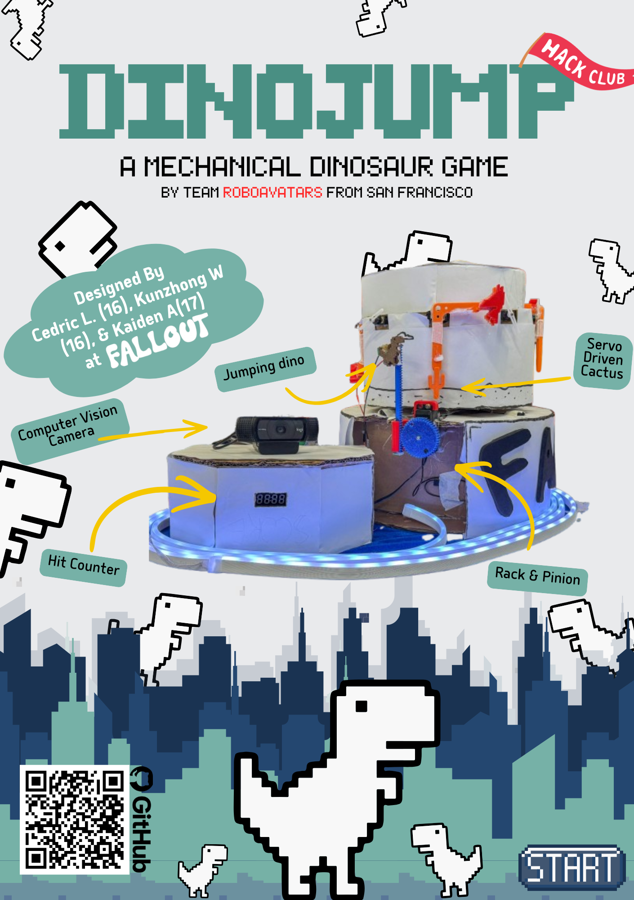

# Dino Jump: Mechanical Dinosaur Game
See our demo video [here](https://youtu.be/Z2IjySYvM9o?si=r-w-ZcUsuN7d3cY8)

# Event Photos

## Zine:

## Why?
### It's 2026, the world has just ended shortly following the Fallout Hackathon...
Within weeks, Canned Wifi supplies have ran out. People have no choice but to the play the classic Chrome Dinosaur game that pops up without internet access.

We wanted to focus on making a **mechanical version of the game** that relies on **hardware components and physical interaction** rather than heavy software. For this reason, we wanted the Dinosaur to physically interact with the obstacles.

Keeping in mind a focus on physicality (and to make the game more fun) the game is **controlled by a person's physical movement (Jumping/Standing/Crouching)**.

Also, the lack of stable wifi at the venue heavily inspired our idea.

## How?

### 1. The Obstacles:
- The Obstacles are mounted to a large circular disc (a Carousel) **powered directly by a small DC motor.**
- The motor **spins to send obstacles** to the Dinosaur.
- The obstacles are mounted to 4-8 servos, which **randomize the obstacles by either flipping to a** **Cactus, Bird, or nothing.**
- A **small limit switch mounted to the bottom of the carousel**, which brushes up against carefully placed foam bumps, **tells the obstacles when to randomize** their position.

### 2. The Dinosaur
- A **small rack and pinion** assembly moves the stationary Dinosaur up and down
- A small pin allows the dinosaur to **physically touch the obstacles**
- A limit switch pressed up against the Dinosaur **detects hits against the obstacles** when the Dinosaur is physically hit

### 3. Computer Vision
- Mediapipe detects the **position of body limbs**
- OpenCV **processes the camera input**
- **Serial connection** to an ESP32 controls the rack and pinion.

### 4. Electronics
- Since the Carousel is rotating on the base, **there can be no wires that are shared between the two.**
- **The Carousel**
  - The Carousel is powered by Quadruple AA battery pack that supplies 6V to the motor and servos.
  - We use a linear voltage regulator to step down to 3.3V for the ESP32.
  - The DC motor runs on a DRVAA33, and servos run on a PCA9685.
  - A limit switch localizes the position of the carousel to ensure that the obstacles randomize when not facing the user.
- **The Base**
  - The Base is powered by a 5V wall adapter.
  - An powers the rack and pinion, connected to another PCA9685.
  - ESP32 recieves Serial commands ("Standing", "Jumping", "Squatting").

## Assembly
- **You may assemble each component in any order**.
- ### The Base
  - Cut two 12in. diameter cardboard circles.
  - On one of the circles, mount the with zipties.
  - Build a central cylinder that is taller than 140mm.
  - Glue the circles to the ends of the cylinder.
  - Cut the top circle to mount the rack and pinion assembly as shown:
  
  - Attach 4 foam bumpers such that they hit the limit switch every 2 servos, as shown:
  - 
- ### The Carousel
  - Cut 8 cardboard strips which are roughly 220mm by 110mm. Fold a 70mm section, followed by a 60mm section, a 30mm section, and another 60mm section. It should look like:

    | 70mm    | 60mm | 30mm | 60mm |
    |---------|------|----|------|
  - Fold the strips into trapezoids, with the 70mm and 30mm sides being parallel. Assemble as shown
  - Cut out slots for servos, as shown:
  
  - Assemble the octagon with hot glue and tape. Take your time!
  - Attach the obstacles to the servos using the servo horn
  - Cut a circle roughly 10in. in diameter, it should be the same diameter as the octagon
  - Mount the motor and mount using zipties and M3 screws
  - Follow the wiring diagram (wire before final assembly)
  - Mount the circle and octagon with hot glue
  

## Software
- Flash corresponding sketches to each ESP32 S3 using Arduino IDE
- If you do not get a serial output/input, try changing the USB CDC setting

## Usage
- Power the Base by plugging in the wall connector
- Start vision.py and follow on screen cailbration
- Position the 0 servo next to the limit switch bump
- Power the Carousel by turning on the battery
